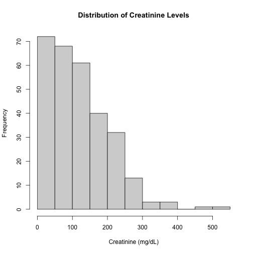
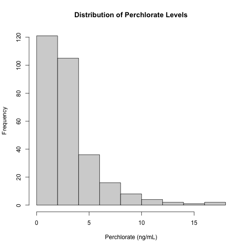
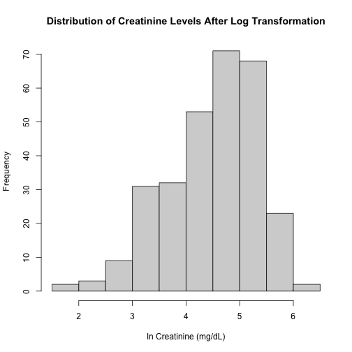
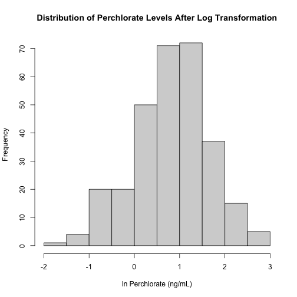
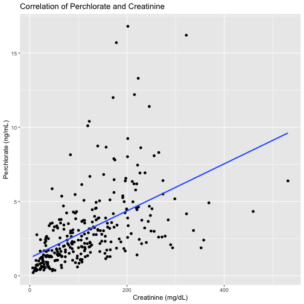
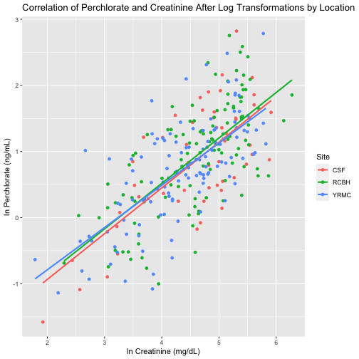
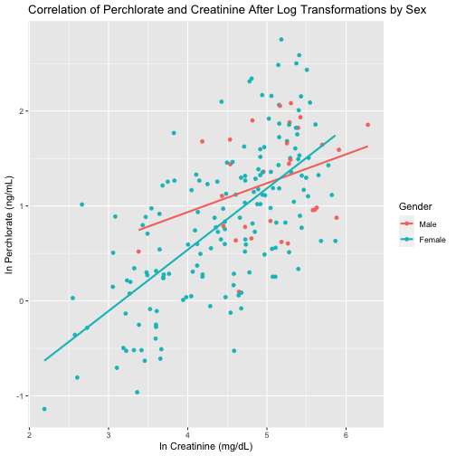

```r
library(readxl)
Creatinine <- read_excel("~/Desktop/Research/Yuma/Yuma - R Project/2021-0072_Urinary Creatinine Results.xlsx", skip=6)
Perchlorate <- read_excel("~/Desktop/Research/Yuma/Yuma - R Project/2021-0072_Urinary Perchlorate Report.xlsx", skip=7)

#Light cleaning
Creatinine$`Sample ID` <- gsub("YRMC-", "Y1", Creatinine$`Sample ID`)
Perchlorate$`Sample ID` <- gsub("YRMC-", "Y1", Perchlorate$`Sample ID`)
```

## Merging Datasets for Analysis

```r
Urine_Perch_Creat <- merge(Creatinine, Perchlorate, by=c("Sample ID"), all = T)
Urine_Perch_Creat <- as.data.frame(Urine_Perch_Creat)
Urine_Perch_Creat <- Urine_Perch_Creat[, c("Sample ID", "Result.x", "LOD.x", "Result.y", "LOD.y")]
unique(Creatinine$Units)
```

```
## [1] "mg/dL"
```

```r
unique(Perchlorate$Units)
```

```
## [1] "ng/mL"
```

```r
colnames(Urine_Perch_Creat) <- c("Sample_ID", "Result_C_mg_dL", "LOD_C", "Result_P_ng_mL", "LOD_P")

Urine_Perch_Creat$Result_C[Urine_Perch_Creat$Result_C=="NR"] <- NA

#Of the 297 observations, 2 have missing values for both creatinine and perchlorate, and 1 has missing value for creatinine but measured values for perchlorate, such that 294 obersvations are paired with measured values.

library(dplyr)
library(knitr)
kable(Urine_Perch_Creat %>% 
  filter(!is.na(Result_C_mg_dL)) %>% 
  summarise("n Creatinine < LOD"=sum(Result_C_mg_dL<LOD_C, na.rm = T),
            "n Perchlorate < LOD"=sum(Result_P_ng_mL<LOD_P, na.rm = T)))
```


| n Creatinine < LOD| n Perchlorate < LOD|
|------------------:|-------------------:|
|                  0|                   0|

```r
#Rows with missing data for either creatinine or perchorate have been removed from the dataset (DF=99%). No replacement needed - all detected values above LOD.
```

## Checking Distributions

```r
hist(as.numeric(Urine_Perch_Creat$Result_C_mg_dL), xlab = "Creatinine (mg/dL)", main = "Distribution of Creatinine Levels")
```

```
## Warning in hist(as.numeric(Urine_Perch_Creat$Result_C_mg_dL), xlab = "Creatinine (mg/dL)", : NAs introduced by coercion
```



```r
hist(as.numeric(Urine_Perch_Creat$Result_P_ng_mL), xlab = "Perchlorate (ng/mL)", main = "Distribution of Perchlorate Levels")
```



```r
hist(log(as.numeric(Urine_Perch_Creat$Result_C_mg_dL)), xlab = "ln Creatinine (mg/dL)", main = "Distribution of Creatinine Levels After Log Transformation")
```

```
## Warning in hist(log(as.numeric(Urine_Perch_Creat$Result_C_mg_dL)), xlab = "ln Creatinine (mg/dL)", : NAs introduced by
## coercion
```



```r
hist(log(as.numeric(Urine_Perch_Creat$Result_P_ng_mL)), xlab = "ln Perchlorate (ng/mL)", main = "Distribution of Perchlorate Levels After Log Transformation")
```



## Analyzing Correlation of Creatinine and Perchlorate

```r
library(ggplot2)

ggplot(Urine_Perch_Creat, aes(x=as.numeric(Result_C_mg_dL), y=as.numeric(Result_P_ng_mL)))+
  geom_point()+
  geom_smooth(method=lm, se=F)+
  xlab("Creatinine (mg/dL)")+
  ylab("Perchlorate (ng/mL)")+
  ggtitle("Correlation of Perchlorate and Creatinine")
```

```
## Warning in FUN(X[[i]], ...): NAs introduced by coercion

## Warning in FUN(X[[i]], ...): NAs introduced by coercion

## Warning in FUN(X[[i]], ...): NAs introduced by coercion
```

```
## `geom_smooth()` using formula 'y ~ x'
```

```
## Warning: Removed 3 rows containing non-finite values (stat_smooth).
```

```
## Warning: Removed 3 rows containing missing values (geom_point).
```



```r
ggplot(Urine_Perch_Creat, aes(x=log(as.numeric(Result_C_mg_dL)), y=log(as.numeric(Result_P_ng_mL))))+
  geom_point()+
  geom_smooth(method=lm, se=F)+
  xlab("ln Creatinine (mg/dL)")+
  ylab("ln Perchlorate (ng/mL)")+
  ggtitle("Correlation of Perchlorate and Creatinine After Log Transformations")
```

```
## Warning in FUN(X[[i]], ...): NAs introduced by coercion
```

```
## Warning in FUN(X[[i]], ...): NAs introduced by coercion

## Warning in FUN(X[[i]], ...): NAs introduced by coercion
```

```
## `geom_smooth()` using formula 'y ~ x'
```

```
## Warning: Removed 3 rows containing non-finite values (stat_smooth).
```

```
## Warning: Removed 3 rows containing missing values (geom_point).
```


```r
cor.test(log(as.numeric(Urine_Perch_Creat$Result_C_mg_dL)), log(as.numeric(Urine_Perch_Creat$Result_P_ng_mL)))
```

```
## Warning in cor.test(log(as.numeric(Urine_Perch_Creat$Result_C_mg_dL)), log(as.numeric(Urine_Perch_Creat$Result_P_ng_mL))): NAs
## introduced by coercion
```

```
## 
## 	Pearson's product-moment correlation
## 
## data:  log(as.numeric(Urine_Perch_Creat$Result_C_mg_dL)) and log(as.numeric(Urine_Perch_Creat$Result_P_ng_mL))
## t = 16.696, df = 292, p-value < 2.2e-16
## alternative hypothesis: true correlation is not equal to 0
## 95 percent confidence interval:
##  0.6352580 0.7530543
## sample estimates:
##       cor 
## 0.6988647
```

### Checking for Grouping by Site

```r
Urine_Perch_Creat$Site <- substr(as.character(Urine_Perch_Creat$Sample_ID),7,7)

ggplot(Urine_Perch_Creat, aes(x=log(as.numeric(Result_C_mg_dL)), y=log(as.numeric(Result_P_ng_mL)), color=as.factor(Site)))+
  geom_point()+
  geom_smooth(method=lm, se=F)+
  scale_color_discrete("Site", labels=c("C"="CSF", "R"="RCBH", "Y"="YRMC"))+
  xlab("ln Creatinine (mg/dL)")+
  ylab("ln Perchlorate (ng/mL)")+
  ggtitle("Correlation of Perchlorate and Creatinine After Log Transformations by Location")
```

```
## Warning in FUN(X[[i]], ...): NAs introduced by coercion

## Warning in FUN(X[[i]], ...): NAs introduced by coercion

## Warning in FUN(X[[i]], ...): NAs introduced by coercion
```

```
## `geom_smooth()` using formula 'y ~ x'
```

```
## Warning: Removed 3 rows containing non-finite values (stat_smooth).
```

```
## Warning: Removed 3 rows containing missing values (geom_point).
```



```r
kable(Urine_Perch_Creat %>% 
        summarise("CSF"=sum(Site=="C"),
                  "RCBH"=sum(Site=="R"),
                  "YRMC"=sum(Site=="Y"),
                  "NA"=sum(is.na(Site))))
```


| CSF| RCBH| YRMC| NA|
|---:|----:|----:|--:|
|  53|  119|  125|  0|

### Checking for Grouping by Sex

```r
library(dplyr)

ID_Gender <- Metals[, c("ID", "Gender")]
Urine_Perch_Creat$ID <- substr(as.character(Urine_Perch_Creat$Sample_ID),7,11)

df1 <- merge(ID_Gender, Urine_Perch_Creat, by="ID")
df1 <- as.data.frame(df1)

ggplot(subset(df1, !is.na(df1$Gender)), aes(x=log(as.numeric(Result_C_mg_dL)), y=log(as.numeric(Result_P_ng_mL)), color=as.factor(Gender)))+
  geom_point()+
  geom_smooth(method=lm, se=F)+
  scale_color_discrete("Gender", labels=c("1"="Male", "2"="Female"))+
  xlab("ln Creatinine (mg/dL)")+
  ylab("ln Perchlorate (ng/mL)")+
  ggtitle("Correlation of Perchlorate and Creatinine After Log Transformations by Sex")  
```

```
## Warning in FUN(X[[i]], ...): NAs introduced by coercion

## Warning in FUN(X[[i]], ...): NAs introduced by coercion

## Warning in FUN(X[[i]], ...): NAs introduced by coercion
```

```
## `geom_smooth()` using formula 'y ~ x'
```

```
## Warning: Removed 2 rows containing non-finite values (stat_smooth).
```

```
## Warning: Removed 2 rows containing missing values (geom_point).
```



```r
kable(df1 %>% 
        summarise("Males"=sum(Gender==1, na.rm=T),
                  "Females"=sum(Gender==2, na.rm=T),
                  "NA"=sum(is.na(Gender))))
```


| Males| Females| NA|
|-----:|-------:|--:|
|    30|     166|  2|
